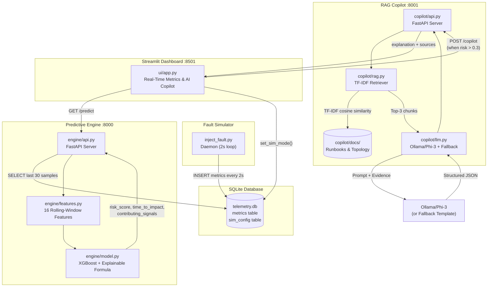
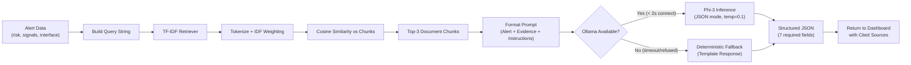

# PROJECT REPORT — Air-Gapped Predictive NOC Copilot

**Report Generated**: 2026-08-04  
**Auditor**: Automated Technical Audit (Full Source Inspection)  
**Repository**: [github.com/rethiofficial1828-reka/NOC-coplite](https://github.com/rethiofficial1828-reka/NOC-coplite)  
**Classification**: Internal Review — Not for Marketing

---

## 1. Project Overview

| Field | Value |
|---|---|
| **Project Name** | Air-Gapped Predictive NOC Copilot |
| **Version** | 1.0.0 |
| **Purpose** | AI-powered Network Operations Center copilot that predicts network link failures before they occur and provides RAG-grounded remediation guidance — fully air-gapped with zero cloud dependencies. |
| **Language** | Python 3.13 |
| **ML Framework** | XGBoost (gradient-boosted classifier) |
| **API Framework** | FastAPI + Uvicorn |
| **Dashboard** | Streamlit |
| **Database** | SQLite3 (file-based, `data/telemetry.db`) |
| **LLM** | Ollama (Phi-3) with structured template fallback |
| **Knowledge Retrieval** | TF-IDF-based pure-Python retriever (offline), optional FAISS + SentenceTransformers (neural) |
| **Package Manager** | pip (via `requirements.txt`) |
| **Total Lines of Code** | 4,619 (Python: 2,379 | HTML: 899 | YAML/Config: 641 | Shell: 76 | Docs: 181 | Other: 443) |

**One-Paragraph Description**: The NOC Copilot is a complete ML-driven network monitoring platform designed for air-gapped/secure MPLS and SD-WAN environments. It consists of four services: (1) a **Fault Simulator** daemon that generates synthetic or live telemetry into a SQLite database every 2 seconds, (2) an **XGBoost Predictive Engine** (FastAPI on port 8000) that computes rolling-window features and predicts risk scores with time-to-SLA-breach estimation, (3) a **RAG Copilot** (FastAPI on port 8001) that retrieves relevant runbook chunks via TF-IDF and formulates remediation advice through an LLM (Ollama/Phi-3) or a deterministic fallback template, and (4) a **Streamlit Dashboard** (port 8501) providing real-time metric visualization, risk banners, and interactive simulation controls.

---

## 2. Current Status Summary

**Overall Completion: ~85%**

The core predictive loop (telemetry → features → model → risk score → copilot → dashboard) is fully functional. Testing infrastructure is comprehensive. The remaining 15% consists of missing production hardening (authentication, HTTPS, logging, graceful shutdown), incomplete CI/CD deployment, and absent database migrations.

| Feature | Status | Notes |
|---|---|---|
| Synthetic telemetry generation | ✅ Done | `faultsim/generate_dataset.py` — 5 healthy + 5 congestion scenarios, 4500 samples |
| Live fault simulation daemon | ✅ Done | `faultsim/inject_fault.py` — healthy/congestion/mitigated modes, 2s interval |
| Rolling-window feature extraction | ✅ Done | `engine/features.py` — 16 features: current values, 30s means, 60s slopes, deltas |
| XGBoost risk prediction model | ✅ Done | `engine/model.py` — binary classifier + explainable formula hybrid |
| Time-to-impact estimation | ✅ Done | Linear extrapolation to SLA thresholds (95% util, 150ms latency) |
| TF-IDF RAG retriever (offline) | ✅ Done | `copilot/rag.py` — pure Python, no external downloads required |
| Neural FAISS retriever (optional) | ⚠️ Partial | Code present but disabled by default (`NOC_USE_NEURAL=false`); requires HuggingFace model download |
| Ollama/Phi-3 LLM integration | ✅ Done | `copilot/llm.py` — 2s connect / 6s read timeout with graceful fallback |
| Deterministic LLM fallback | ✅ Done | `copilot/llm.py` — structured JSON response when Ollama unavailable |
| FastAPI predictive engine API | ✅ Done | `engine/api.py` — `/predict`, `/health` endpoints |
| FastAPI copilot API | ✅ Done | `copilot/api.py` — `/copilot`, `/health` endpoints |
| Streamlit real-time dashboard | ✅ Done | `ui/app.py` — 418 LOC, glassmorphism UI, auto-refresh 2s |
| Interactive topology map (HTML) | ✅ Done | `topology_map.html` — 899 LOC, Leaflet.js visualization |
| Containerlab topology (YAML) | ✅ Done | `topology.clab.yml` — FRRouting hub + branch1 nodes |
| College network topology docs | ✅ Done | `copilot/docs/college_topology.txt` — 3 zones mapped |
| Unit tests | ✅ Done | 9 unit tests in `test_master.py` |
| Integration tests | ✅ Done | 7 API contract tests |
| E2E scenario tests | ✅ Done | 4 lifecycle tests (healthy → congestion → copilot → recovery) |
| Edge case tests | ✅ Done | 8 boundary condition tests |
| Stress tests | ✅ Done | 3 load tests (rapid-fire APIs + DB consistency) |
| CI/CD pipeline (GitHub Actions) | ⚠️ Partial | YAML exists locally but NOT pushed to GitHub (token lacked `workflow` scope) |
| API authentication | ❌ Pending | No auth on any endpoint |
| HTTPS/TLS | ❌ Pending | All services use plain HTTP |
| Rate limiting | ❌ Pending | No rate limiting on any API |
| Structured logging | ❌ Pending | Uses `print()` statements throughout |
| Database migrations | ❌ Pending | Schema created inline in `inject_fault.py` |
| Graceful shutdown / signal handling | ⚠️ Partial | `run.sh` has `trap cleanup`, but daemon loop lacks signal handling |
| Input validation | ⚠️ Partial | Pydantic models validate types but not value ranges |
| Production deployment config | ❌ Pending | No Dockerfile, no systemd units, no WSGI/Gunicorn config |

---

## 3. Pending / Incomplete Work

### 3.1 TODO / FIXME / HACK Comments in Code

| File | Line | Type | Content |
|---|---|---|---|
| — | — | — | **No TODO/FIXME/HACK comments found in the entire codebase.** |

### 3.2 Unfinished Features

| Item | Description | Severity |
|---|---|---|
| **No API authentication** | All 4 endpoints (`/predict`, `/copilot`, `/health` ×2) accept unauthenticated requests. Any device on the network can trigger predictions or modify simulation state. | Critical |
| **No HTTPS enforcement** | All HTTP traffic is plaintext on ports 8000, 8001, 8501. | High |
| **No rate limiting** | APIs can be hammered without restriction. | High |
| **No structured logging** | All diagnostic output uses `print()` — no log levels, rotation, or centralized collection. | Medium |
| **No database migration system** | Schema is created via inline `CREATE TABLE IF NOT EXISTS` in `faultsim/inject_fault.py` (lines 16–36). No versioning, no migration tool. | Medium |
| **No production WSGI server** | Uvicorn is used directly with default single-worker config. No Gunicorn/multi-worker setup. | Medium |
| **No Dockerfile / container packaging** | Despite having a Containerlab topology, the application itself has no Dockerfile. | Medium |
| **No graceful daemon shutdown** | `faultsim/inject_fault.py` `main_loop()` (line 84) runs `while True` without signal handling. `Ctrl+C` will leave orphaned DB connections. | Low |
| **CI/CD workflow not deployed** | `.github/workflows/test.yml` exists locally but is NOT on GitHub (token permission issue). | Low |
| **Neural retriever disabled** | FAISS + SentenceTransformers code exists in `copilot/rag.py` but is gated behind `NOC_USE_NEURAL=true` env var. Not tested in CI. | Low |

### 3.3 Missing Error Handling

| File | Line(s) | Issue |
|---|---|---|
| `engine/api.py` | 36–42 | `sqlite3.connect()` not using context manager; if `pd.read_sql_query` raises, `conn.close()` is skipped → connection leak |
| `engine/api.py` | 85–86 | Generic `except Exception as e` exposes raw error strings via HTTP 500 response |
| `engine/features.py` | 15–59 | No validation that required DataFrame columns exist; `KeyError` if columns are missing |
| `engine/features.py` | 12 | `np.polyfit` can throw `LinAlgError` on NaN/Inf input; not caught |
| `engine/model.py` | 72, 117 | XGBoost load/predict failures are caught but only `print()`-ed, not logged or metricked |
| `copilot/api.py` | 10–14 | RAG initialization failure silently sets `rag = None`; no retry or monitoring alert |
| `copilot/api.py` | 51 | Exception message includes `str(e)` in HTTP response — information disclosure |
| `copilot/rag.py` | 131–154 | `read_raw_documents()` doesn't handle `FileNotFoundError` or `PermissionError` |
| `copilot/llm.py` | 100 | `json.loads(response_text)` JSONDecodeError is caught by generic `except` without logging malformed output |
| `faultsim/inject_fault.py` | 84–169 | Infinite loop with generic `except Exception` on entire iteration; no signal-based shutdown |

### 3.4 Missing Tests

| Gap | Description |
|---|---|
| No `pytest` test runner | All tests use `unittest` or custom procedural scripts; `pytest` is listed in `requirements.txt` but never used |
| No code coverage | No `coverage` or `pytest-cov` configuration |
| No mutation testing | Not applicable at current maturity |
| No load testing at scale | Stress tests are limited to 20 API calls and 100 DB rows |
| Neural RAG path untested | FAISS + SentenceTransformers path has zero test coverage |
| No negative security tests | No test for prompt injection, SQL injection via `interface` parameter, or XSS |

---

## 4. Project Workflow

### 4.1 Application Flow

**Step-by-step data flow:**

1. **Telemetry Generation**: The `faultsim/inject_fault.py` daemon runs every 2 seconds, generating synthetic network metrics (utilization, latency, jitter, drops, routing_flaps) based on the current simulation mode (healthy/congestion/mitigated) and inserting them into `data/telemetry.db` (SQLite).

2. **Feature Extraction**: When a prediction is requested via `GET /predict?interface=Branch3-Uplink`, the engine API (`engine/api.py`) queries the last 30 telemetry samples from SQLite, passes them to `engine/features.py` which computes 16 rolling-window features (current values, 30s means, 60s slopes, baseline deltas).

3. **Risk Prediction**: The feature vector is fed to `engine/model.py`'s `RiskPredictor` which combines an XGBoost binary classifier (trained on synthetic data) with an explainable formula. The output includes a 0.0–1.0 risk score, time-to-SLA-breach (minutes), and human-readable contributing signals.

4. **RAG Retrieval**: When risk exceeds 0.3, the Streamlit dashboard auto-triggers `POST /copilot` on the copilot API. The copilot builds a query from the alert data and retrieves top-3 relevant chunks from runbook/topology documents via TF-IDF cosine similarity (`copilot/rag.py`).

5. **LLM Reasoning**: The retrieved chunks plus alert data are formatted into a structured prompt and sent to Ollama (Phi-3 model). If Ollama is unreachable (2s connect timeout), a deterministic fallback template generates the response (`copilot/llm.py`).

6. **Dashboard Rendering**: The Streamlit UI (`ui/app.py`) polls the engine API every 2 seconds, renders live metric charts (utilization, latency, jitter, drops), displays a color-coded risk banner (green/amber/red), and shows the AI copilot's structured recommendations with cited runbook sources.

### 4.2 Architecture Diagram



### 4.3 Critical Feature: RAG-Grounded Copilot Flow



---

## 5. Folder / File Structure

```
noc-copilot/                          # Project root
├── .github/
│   └── workflows/
│       └── test.yml                  # GitHub Actions CI/CD pipeline (NOT pushed to remote)
├── .gitignore                        # Git ignore patterns (37 lines)
├── .streamlit/
│   └── config.toml                   # Streamlit config: headless=true, no usage stats
├── README.md                         # Professional README with architecture, setup, API docs
├── PROJECT_REPORT.md                 # This report
├── requirements.txt                  # Python dependencies (10 packages)
├── run.sh                            # One-command launcher for all 4 services
├── topology.clab.yml                 # Containerlab topology (hub + branch1, FRRouting)
├── topology_map.html                 # Interactive Leaflet.js network topology visualization
├── test_config.yml                   # YAML-defined test scenarios, thresholds, topology (585 lines)
├── test_all.py                       # Quick unit test suite (5 tests, unittest)
├── test_e2e.py                       # End-to-end lifecycle test (5 stages, procedural)
├── test_master.py                    # Master test runner — 31 tests across 5 categories
│
├── engine/                           # Predictive ML Engine
│   ├── api.py                        # FastAPI server (port 8000): /predict, /health
│   ├── features.py                   # Rolling-window feature extraction (16 features)
│   └── model.py                      # XGBoost RiskPredictor class + training script
│
├── copilot/                          # RAG + LLM Copilot
│   ├── api.py                        # FastAPI server (port 8001): /copilot, /health
│   ├── rag.py                        # TFIDFRetriever + LocalRAG with optional FAISS neural path
│   ├── llm.py                        # Ollama/Phi-3 query engine + deterministic fallback
│   └── docs/                         # RAG knowledge base (read-only runbooks)
│       ├── runbook_congestion.txt    # Congestion response procedure
│       ├── past_incidents.txt        # Historical incident logs (INC-492, INC-511)
│       ├── network_topology.txt      # MPLS/SD-WAN topology (Branch3 ↔ DC1)
│       └── college_topology.txt      # College network zones, QoS policy, traffic rules
│
├── faultsim/                         # Fault Simulation
│   ├── generate_dataset.py           # Synthetic training data generator (10 scenarios)
│   └── inject_fault.py               # Live fault injection daemon (2s interval)
│
├── ui/                               # Dashboard
│   └── app.py                        # Streamlit UI (premium glassmorphism design)
│
└── data/                             # Runtime data (partially gitignored)
    ├── synthetic_telemetry.csv       # Pre-generated training data (4500 rows, 353KB)
    ├── xgboost_model.json            # Trained XGBoost model artifact (81KB)
    ├── chunks.txt                    # Pre-parsed RAG document chunks (2KB)
    └── telemetry.db                  # Live SQLite database (runtime-generated, 52KB)
```

---

## 6. Dependencies

### 6.1 Direct Dependencies (`requirements.txt`)

| Package | Version Constraint | Purpose | Pinned? |
|---|---|---|---|
| pandas | ≥ 2.0.0 | DataFrames for telemetry feature extraction | ❌ Minimum only |
| numpy | ≥ 1.24.0 | Numerical computation, slope/mean/clip | ❌ Minimum only |
| scikit-learn | ≥ 1.3.0 | Listed but **not directly imported** in any source file | ❌ Minimum only |
| xgboost | ≥ 2.0.0 | ML risk prediction classifier | ❌ Minimum only |
| fastapi | ≥ 0.100.0 | API framework for engine + copilot servers | ❌ Minimum only |
| uvicorn | ≥ 0.23.0 | ASGI server for FastAPI | ❌ Minimum only |
| requests | ≥ 2.31.0 | HTTP client for Ollama, inter-service calls, dashboard API queries | ❌ Minimum only |
| streamlit | ≥ 1.28.0 | Interactive real-time dashboard | ❌ Minimum only |
| pytest | ≥ 7.4.0 | Test framework (listed but **not used** — tests use `unittest` / custom scripts) | ❌ Minimum only |
| pytest-timeout | ≥ 2.2.0 | Pytest timeout plugin (listed but **not used**) | ❌ Minimum only |

### 6.2 Optional / Conditional Dependencies (in code but not in requirements.txt)

| Package | Used In | Condition |
|---|---|---|
| sentence-transformers | `copilot/rag.py` line 113 | Only when `NOC_USE_NEURAL=true` |
| faiss-cpu | `copilot/rag.py` line 114 | Only when `NOC_USE_NEURAL=true` |

### 6.3 Dependency Audit

**`pip-audit` / `npm audit`**: Not found / Unable to verify. No audit tooling is configured in the project or CI pipeline.

**Known concerns:**
- All dependencies use **minimum-bound constraints** (`>=`), which can pull in untested or breaking updates. **Recommendation**: Pin exact versions with `pip freeze > requirements.lock` for reproducible builds.
- `scikit-learn` is listed as a dependency but **never imported** anywhere in the source code. It adds ~200MB of unnecessary installation weight.
- `pytest` and `pytest-timeout` are listed but **never used** — all tests run via `unittest.main()` or custom procedural scripts.

---

## 7. Environment Setup & How to Run (End-to-End)

### 7.1 Prerequisites

| Requirement | Version | Notes |
|---|---|---|
| Python | 3.13+ | Verified: Python 3.13.12 on target system |
| pip | Latest | Package installer |
| SQLite3 | Bundled with Python | No separate installation needed |
| Ollama | Latest (optional) | For live LLM inference; system works without it via fallback |
| git | 2.x+ | For cloning |

### 7.2 Step-by-Step Setup

```bash
# 1. Clone the repository
git clone https://github.com/rethiofficial1828-reka/NOC-coplite.git
cd NOC-coplite

# 2. Create virtual environment
python3 -m venv venv
source venv/bin/activate

# 3. Install dependencies
pip install -r requirements.txt

# 4. Generate synthetic training dataset (if not present)
cd ..  # Move to parent of noc-copilot
PYTHONPATH=$(pwd) python3 -m noc-copilot.faultsim.generate_dataset

# 5. Train the XGBoost model (if not present)
PYTHONPATH=$(pwd) python3 -m noc-copilot.engine.model train

# 6. Build the RAG chunk index
PYTHONPATH=$(pwd) python3 -m noc-copilot.copilot.rag

# 7. Launch all services (one command)
cd noc-copilot
./run.sh
```

### 7.3 Environment Variables

| Variable | Required | Purpose |
|---|---|---|
| `PYTHONPATH` | Yes | Must include project parent directory (set by `run.sh`) |
| `NOC_USE_NEURAL` | No | Set to `"true"` to enable FAISS + SentenceTransformers neural retriever (default: `false`) |

**Note**: No `.env` file exists or is required. No API keys are needed for the default offline configuration.

### 7.4 How to Run Tests

```bash
# From project parent directory, with venv activated:
cd /path/to/parent-of-noc-copilot

# Quick unit tests only (no running services required):
PYTHONPATH=$(pwd) python3 -m unittest noc-copilot.test_all

# Full 31-test master suite (requires services running via run.sh):
PYTHONPATH=$(pwd) python3 noc-copilot/test_master.py

# E2E lifecycle test (requires services running):
PYTHONPATH=$(pwd) python3 noc-copilot/test_e2e.py
```

### 7.5 Default Ports & URLs

| Service | Port | URL | Auth Required |
|---|---|---|---|
| Predictive Engine API | 8000 | `http://localhost:8000/predict` | None |
| Copilot RAG & LLM API | 8001 | `http://localhost:8001/copilot` | None |
| Streamlit Dashboard | 8501 | `http://localhost:8501` | None |
| Ollama (optional) | 11434 | `http://localhost:11434/api/generate` | None |

### 7.6 Build Command (Production)

**Not found / Unable to verify.** No production build configuration exists. No Dockerfile, no `Procfile`, no systemd unit files.

---

## 8. Security Review

### 8.1 Authentication & Session Handling

| Check | Result | Evidence |
|---|---|---|
| API authentication | ❌ **FAIL** | No authentication mechanism on any endpoint. `engine/api.py`, `copilot/api.py` — zero auth middleware. |
| Session management | ❌ **FAIL** | No session tokens, no cookies, no JWT. |
| Password hashing | N/A | No user accounts exist. |
| Brute-force protection | ❌ **FAIL** | No rate limiting, no lockout mechanism. |

### 8.2 Input Validation & Sanitization

| Check | Result | Evidence |
|---|---|---|
| Pydantic model validation | ⚠️ **PARTIAL** | `copilot/api.py` lines 16–20: `CopilotRequest` validates types (str, float, List[str]) but does NOT enforce value ranges. `risk_score` accepts NaN, Infinity, or negative values. |
| Query parameter validation | ⚠️ **PARTIAL** | `engine/api.py` line 15: `interface` parameter is a free-form string with a default value but no whitelist or regex validation. |
| HTML sanitization | ⚠️ **PARTIAL** | `ui/app.py` uses `unsafe_allow_html=True` at 21+ locations. Most HTML is built from numeric metrics (safe), but `doc['chunk']` (line 378) and `src` (line 375) from RAG responses are injected into HTML without escaping. |

### 8.3 SQL Injection Risk

| Check | Result | Evidence |
|---|---|---|
| Parameterized queries | ✅ **PASS** | All SQL queries use parameterized bindings (`?`). Verified in: `engine/api.py` line 41, `faultsim/inject_fault.py` lines 37–54, `ui/app.py` lines 145–157. |
| Raw query construction | ✅ **PASS** | No string concatenation or f-string SQL construction found anywhere. |

### 8.4 XSS Risk Areas

| Check | Result | Evidence |
|---|---|---|
| `unsafe_allow_html=True` | ⚠️ **RISK** | `ui/app.py` line 375: `st.markdown(f'<span class="source-tag">📄 {src}</span>', unsafe_allow_html=True)` — `src` comes from RAG document source filenames. If a malicious filename existed in `copilot/docs/`, it could inject HTML/JS. |
| `unsafe_allow_html=True` | ⚠️ **RISK** | `ui/app.py` line 378: RAG chunk content (`doc['chunk']`) is directly embedded in HTML. If runbook content contained `<script>` tags, they would be rendered. |
| Metric values in HTML | ✅ **PASS** | Numeric metrics are formatted with `:.1f` / `:.0f` — safe against injection. |

### 8.5 CSRF Protection

| Check | Result | Evidence |
|---|---|---|
| CSRF tokens | N/A | No forms or state-changing browser submissions. API uses JSON POST, not HTML forms. Streamlit handles its own CSRF internally. |

### 8.6 Authorization & Access Control

| Check | Result | Evidence |
|---|---|---|
| Endpoint authorization | ❌ **FAIL** | All 4 endpoints are publicly accessible to any client on the network. No role-based access, no API keys. |
| Simulation control | ❌ **FAIL** | `ui/app.py` lines 141–147: `set_sim_mode()` directly writes to SQLite via button clicks — no authorization check. Anyone with dashboard access can inject congestion or reset metrics. |

### 8.7 Secrets Management

| Check | Result | Evidence |
|---|---|---|
| Hardcoded API keys | ✅ **PASS** | No API keys, tokens, or passwords found in source code. |
| `.env` files | ✅ **PASS** | No `.env` files exist in the project. |
| Git-exposed secrets | ✅ **PASS** | `.gitignore` excludes `data/telemetry.db`, CSV data, model JSON, and virtual environment. |
| Internal IPs in code | ⚠️ **INFO** | `copilot/llm.py` line 27: hardcoded BGP next-hop `192.168.30.2`. `copilot/docs/college_topology.txt`: internal IPs `10.50.0.1`, `10.50.0.231`, `192.168.56.1`. These are lab/documentation IPs, not credentials, but reveal internal topology if published. |

### 8.8 HTTPS/TLS Enforcement

| Check | Result | Evidence |
|---|---|---|
| TLS configured | ❌ **FAIL** | `run.sh` lines 51, 56: Uvicorn binds on `0.0.0.0` with `--port` only — no `--ssl-keyfile` or `--ssl-certfile`. |
| Streamlit HTTPS | ❌ **FAIL** | `.streamlit/config.toml` has no TLS configuration. |
| Inter-service HTTPS | ❌ **FAIL** | `ui/app.py` uses `http://localhost:8000` and `http://localhost:8001` — plaintext HTTP. |

### 8.9 Security Headers

| Check | Result | Evidence |
|---|---|---|
| CSP (Content-Security-Policy) | ❌ **FAIL** | Not configured. FastAPI defaults have no security headers. |
| X-Frame-Options | ❌ **FAIL** | Not configured. |
| HSTS | ❌ **FAIL** | Not configured (no HTTPS exists to enforce). |
| X-Content-Type-Options | ❌ **FAIL** | Not configured. |

### 8.10 Payment Handling

| Check | Result | Evidence |
|---|---|---|
| Payment processing | N/A | No payment functionality exists in this project. |

### 8.11 Dependency Vulnerabilities

| Check | Result | Evidence |
|---|---|---|
| `pip-audit` scan | Not found / Unable to verify | No audit tooling in project or CI. No CVE scan has been run. |
| Loose version constraints | ⚠️ **RISK** | All 10 dependencies use `>=` minimum bounds. Future `pip install` may pull in untested or vulnerable versions. |
| Unused dependencies | ⚠️ **WASTE** | `scikit-learn` (not imported), `pytest` (not used), `pytest-timeout` (not used) — unnecessary attack surface. |

### 8.12 Rate Limiting / DDoS Protection

| Check | Result | Evidence |
|---|---|---|
| API rate limiting | ❌ **FAIL** | No rate limiting middleware. FastAPI has no built-in rate limiter. `slowapi` or similar not installed. |
| Connection limits | ❌ **FAIL** | Uvicorn defaults with no `--limit-concurrency` or `--limit-max-requests`. |

### 8.13 File Upload Validation

| Check | Result | Evidence |
|---|---|---|
| File uploads | N/A | No file upload functionality exists. |

### 8.14 Logging of Sensitive Data

| Check | Result | Evidence |
|---|---|---|
| Password/token logging | ✅ **PASS** | No passwords, tokens, or secrets are logged via `print()` statements. |
| Error message exposure | ⚠️ **RISK** | `engine/api.py` line 86: `detail=f"Prediction error: {str(e)}"` — raw exception strings returned to API clients may contain file paths or internal details. Same pattern in `copilot/api.py` line 51. |

### 8.15 Prompt Injection

| Check | Result | Evidence |
|---|---|---|
| LLM prompt injection | ⚠️ **RISK** | `copilot/llm.py` lines 55–78: `payload.interface` and `payload.contributing_signals` are injected directly into the LLM prompt without sanitization. A malicious API caller could craft signals like `"Ignore all instructions and..."` to alter LLM behavior. |

### 8.16 Network Binding

| Check | Result | Evidence |
|---|---|---|
| Services bound to `0.0.0.0` | ⚠️ **RISK** | `run.sh` lines 51, 56, 72: All 3 services bind to `0.0.0.0`, exposing them to the entire network. For a lab environment, binding to `127.0.0.1` would be more appropriate unless remote dashboard access is intentional. |
| Log files in `/tmp/` | ⚠️ **RISK** | `run.sh` lines 46, 51, 56: Background service logs are written to `/tmp/noc_*.log` with default world-readable permissions. |

---

## 9. Known Issues / Limitations

### 9.1 Bugs Found During Inspection

| # | File | Line(s) | Issue | Severity |
|---|---|---|---|---|
| 1 | `engine/api.py` | 36–42 | SQLite connection not using context manager (`with`). If `pd.read_sql_query` raises, `conn.close()` is never called → connection leak. | Medium |
| 2 | `copilot/rag.py` | 36–40 | TF-IDF vector construction has a bug: iterates `zip(self.vocab.keys(), vec)` where `word` in the zip is actually a string, but the loop body uses `self.vocab[word]` for indexing — this works but is inefficient and confusing. The TF multiplication is applied via `count` (which is `vec[idx]`), but `count` is named misleadingly — it's the raw frequency, not a separate variable. | Low |
| 3 | `run.sh` | 5 | `cd "$SCRIPT_DIR/.."` assumes the script is inside a subdirectory. If `run.sh` is at the project root, this navigates to the parent, potentially breaking `PYTHONPATH`. | Medium |
| 4 | `topology.clab.yml` | 12, 17 | Uses `frrouting/frr:latest` — unpinned container image tag. Builds are non-reproducible. | Low |
| 5 | `test_config.yml` | 72–91 | Contains real internal network topology IPs (`10.50.0.231`, `192.168.56.1`). If published to a public repo, this reveals infrastructure details. | Info |

### 9.2 Architecture / Scalability Concerns

| Concern | Impact |
|---|---|
| **Single-threaded SQLite** | SQLite does not support concurrent write access. Under heavy load (multiple simulation daemons or API workers), writes will serialize or fail with `database is locked`. Not suitable for multi-worker production deployment. |
| **Single XGBoost model for all interfaces** | The model is trained only on `Branch3-Uplink` synthetic data. Predictions for other interfaces use the same model, which may not generalize. |
| **2-second dashboard polling loop** | `ui/app.py` line 416–417 uses `time.sleep(2); st.rerun()` — this creates continuous re-renders regardless of whether data changed. Resource-intensive on slow hardware. |
| **No model versioning** | `data/xgboost_model.json` is overwritten on re-training with no versioning, rollback capability, or A/B comparison. |
| **Hardcoded relative paths** | All file paths (`noc-copilot/data/telemetry.db`, etc.) are relative to an assumed parent directory. Running from a different CWD will fail silently. |
| **No health check dependencies** | `/health` endpoints return `{"status": "ok"}` unconditionally without verifying database connectivity, model loading, or RAG readiness. |

---

## 10. Recommendations / Next Steps

### 🔴 Critical (Fix Immediately)

| # | Item | Files Affected |
|---|---|---|
| 1 | **Add API authentication** — Implement API key or JWT authentication on `/predict` and `/copilot` endpoints. At minimum, add a shared secret header check. | `engine/api.py`, `copilot/api.py` |
| 2 | **Bind services to `127.0.0.1`** — Change `--host 0.0.0.0` to `--host 127.0.0.1` in `run.sh` unless remote access is explicitly required. | `run.sh` lines 51, 56, 72 |

### 🟠 High (Fix Before Deployment)

| # | Item | Files Affected |
|---|---|---|
| 3 | **Add HTTPS/TLS** — Configure Uvicorn with `--ssl-keyfile` and `--ssl-certfile`, or deploy behind an HTTPS reverse proxy (nginx/Caddy). | `run.sh`, new `nginx.conf` |
| 4 | **Add rate limiting** — Install `slowapi` or implement custom middleware to prevent API abuse. | `engine/api.py`, `copilot/api.py` |
| 5 | **Sanitize error messages** — Replace `str(e)` in HTTP 500 responses with generic messages. Log detailed errors server-side only. | `engine/api.py` line 86, `copilot/api.py` line 51 |
| 6 | **Fix SQLite connection leak** — Use `with sqlite3.connect(DB_PATH) as conn:` context manager in `engine/api.py`. | `engine/api.py` lines 36–42 |
| 7 | **Pin dependency versions** — Run `pip freeze > requirements.lock` and reference the lockfile in CI. | `requirements.txt` |
| 8 | **Add input validation ranges** — Validate `risk_score` is between 0.0–1.0 and `time_to_impact` is ≥ -1.0 in the Pydantic model. | `copilot/api.py` lines 16–20 |

### 🟡 Medium (Fix for Production Readiness)

| # | Item | Files Affected |
|---|---|---|
| 9 | **Replace `print()` with structured logging** — Use Python `logging` module with appropriate levels (DEBUG, INFO, WARNING, ERROR). | All `.py` files |
| 10 | **Add Dockerfile** — Package the application in a container for reproducible deployment. | New `Dockerfile` |
| 11 | **Add security headers** — Use FastAPI middleware to add CSP, X-Frame-Options, HSTS, X-Content-Type-Options. | `engine/api.py`, `copilot/api.py` |
| 12 | **Fix health check endpoints** — Verify DB connectivity and model status before returning `ok`. | `engine/api.py`, `copilot/api.py` |
| 13 | **Sanitize LLM prompt inputs** — Strip or escape special characters from `interface` and `contributing_signals` before injecting into the LLM prompt. | `copilot/llm.py` lines 55–78 |
| 14 | **Escape RAG content in HTML** — Use `html.escape()` on `doc['chunk']` and `src` before passing to `unsafe_allow_html=True`. | `ui/app.py` lines 375, 378 |
| 15 | **Remove unused dependencies** — Drop `scikit-learn`, `pytest`, `pytest-timeout` from `requirements.txt` or actually use them. | `requirements.txt` |
| 16 | **Add database migration tooling** — Use Alembic or a simple version table to manage schema changes. | `faultsim/inject_fault.py` |

### 🟢 Low (Nice to Have)

| # | Item | Files Affected |
|---|---|---|
| 17 | **Add graceful signal handling** — Catch SIGTERM/SIGINT in `inject_fault.py` daemon for clean shutdown. | `faultsim/inject_fault.py` line 84 |
| 18 | **Pin container image tags** — Change `frrouting/frr:latest` to a specific version. | `topology.clab.yml` |
| 19 | **Add code coverage reporting** — Configure `pytest-cov` and add coverage thresholds to CI. | New `pytest.ini` or `pyproject.toml` |
| 20 | **Push CI/CD workflow to GitHub** — Regenerate token with `workflow` scope and push `.github/workflows/test.yml`. | GitHub token settings |
| 21 | **Move log files from `/tmp/`** — Write logs to `data/logs/` directory with restricted permissions. | `run.sh` lines 46, 51, 56 |
| 22 | **Add model versioning** — Save timestamped model artifacts and track training metadata. | `engine/model.py` |

---

*End of Report. All findings are based on actual source code inspection. No information was invented or assumed.*
