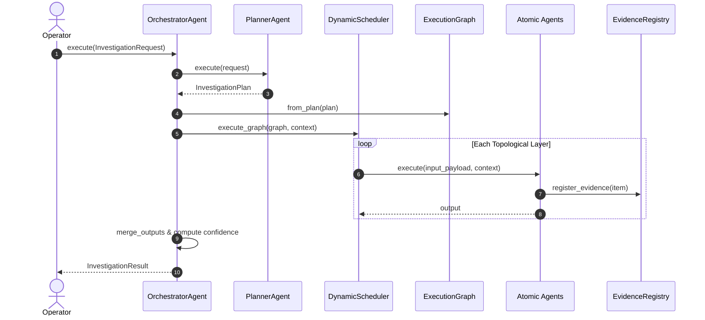

# 🧠 Enterprise AI Investigation Orchestrator (`agents/orchestrator_ai`)

The **Enterprise AI Investigation Orchestrator** transforms NOC Copilot from an event-driven collection of independent agents into a production-grade Enterprise AI Investigation Platform.

It provides the central intelligence layer responsible for planning, scheduling, coordinating, monitoring, and merging the outputs of all Atomic Agents while preserving their independence.

---

## 🏗️ Architecture Principles

- **Atomic Agent Architecture**: Atomic Agents (`TelemetryAgent`, `PredictionAgent`, `IncidentAgent`, `RecommendationAgent`, `TopologyAgent`, `KnowledgeAgent`) remain decoupled and atomic.
- **DAG Execution**: Workflows are dynamically modeled as Directed Acyclic Graphs (DAGs) rather than static sequential chains.
- **Parallel Scheduling**: Independent nodes in a DAG execute concurrently using multi-threaded worker pools.
- **Lineage & Evidence**: Evidence references are registered with confidence scores, timestamps, and lineage links.
- **EventBus Integration**: Complete lifecycle events (`investigation.started`, `investigation.planned`, `agent.execution.completed`, etc.) are broadcast asynchronously.

```
                     ┌──────────────────────┐
                     │ InvestigationRequest │
                     └──────────┬───────────┘
                                │
                                ▼
                        ┌───────────────┐
                        │ PlannerAgent  │ (Complexity & Stage Generation)
                        └───────┬───────┘
                                │
                                ▼
                     ┌─────────────────────┐
                     │  ExecutionGraph DAG │
                     └──────────┬──────────┘
                                │
                                ▼
                     ┌─────────────────────┐
                     │  DynamicScheduler   │ (Topological Parallel Pool)
                     └──────────┬──────────┘
             ┌──────────────────┼──────────────────┐
             ▼                  ▼                  ▼
    ┌────────────────┐ ┌────────────────┐ ┌────────────────┐
    │ TelemetryAgent │ │  TopologyAgent │ │ PredictionAgent│ ...
    └───────┬────────┘ └───────┬────────┘ └───────┬────────┘
            └──────────────────┼──────────────────┘
                               │ (Evidence Registration)
                               ▼
                     ┌───────────────────┐
                     │ EvidenceRegistry  │
                     └─────────┬─────────┘
                               │
                               ▼
                     ┌───────────────────┐
                     │InvestigationResult│
                     └───────────────────┘
```

---

## 🔄 Sequence Diagram



---

## ⚡ DAG Execution Example

```
Layer 1 (Parallel):    [TelemetryAgent]     [TopologyAgent]
                               │                  │
                               ▼                  │
Layer 2 (Sequential):  [PredictionAgent]          │
                               │                  │
                               ▼                  │
Layer 3 (Sequential):   [IncidentAgent]           │
                               │                  │
                               ▼                  │
Layer 4 (Sequential): [RecommendationAgent]       │
                               │                  │
                               └────────┬─────────┘
                                        ▼
Layer 5 (Convergence):          [KnowledgeAgent]
```

---

## 📖 Developer & Extension Guide

### Adding a New Atomic Agent to the Orchestrator
1. Inherit from `BaseAgent` and register the agent with `AgentRegistry.get_global().register_agent(MyNewAgent())`.
2. Update `PlannerAgent._execute_internal` to include `AgentExecutionPlan(agent_name="MyNewAgent", ...)` in the appropriate stage.
3. Update `DynamicScheduler._build_agent_input` to construct input parameters for `MyNewAgent`.

### Performance Tuning
- **Thread Pool Parallelism**: Adjust worker threads when instantiating `DynamicScheduler(max_workers=8)`.
- **Target Confidence Threshold**: Adjust `target_confidence` in `InvestigationPlan` to enable early stopping when adequate evidence is gathered.
