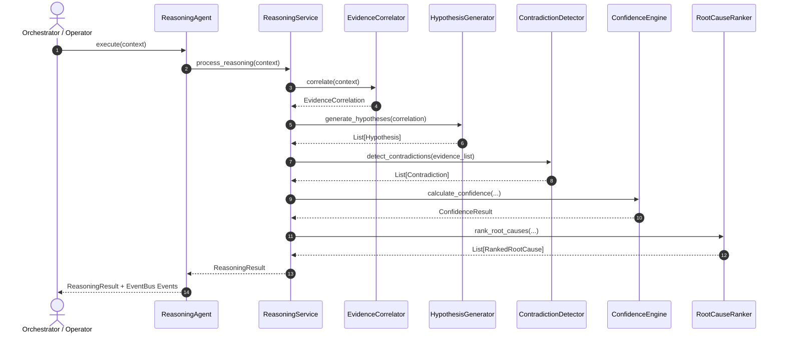

# 🧩 Enterprise Reasoning & Evidence Correlation Engine (`agents/reasoning`)

The **Enterprise Reasoning Subsystem** transforms NOC Copilot into an AI Investigation Engine capable of evidence-driven, explainable root-cause diagnosis.

Rather than jumping directly from raw evidence to final conclusions, the subsystem enforces a structured 8-stage enterprise reasoning pipeline.

---

## 🏗️ Reasoning Pipeline Architecture

```
                    ┌────────────────────────┐
                    │  InvestigationContext  │
                    └───────────┬────────────┘
                                │
                                ▼
                    ┌────────────────────────┐
                    │   EvidenceCorrelator   │ (Deduplication & Grouping)
                    └───────────┬────────────┘
                                │
                                ▼
                    ┌────────────────────────┐
                    │   EvidenceValidator    │ (Freshness & Completeness)
                    └───────────┬────────────┘
                                │
                                ▼
                    ┌────────────────────────┐
                    │  HypothesisGenerator   │ (Competing Hypotheses)
                    └───────────┬────────────┘
                                │
                                ▼
                    ┌────────────────────────┐
                    │ ContradictionDetector  │ (Signal Conflict Penalties)
                    └───────────┬────────────┘
                                │
                                ▼
                    ┌────────────────────────┐
                    │    ConfidenceEngine    │ (Multi-Factor Confidence)
                    └───────────┬────────────┘
                                │
                                ▼
                    ┌────────────────────────┐
                    │    RootCauseRanker     │ (Weighted Hypothesis Ranking)
                    └───────────┬────────────┘
                                │
                                ▼
                    ┌────────────────────────┐
                    │InvestigationConclusion │ (Explainable Rationale Output)
                    └────────────────────────┘
```

---

## 🔄 Sequence Diagram



---

## 📊 Root Cause Ranking & Explainability

Every conclusion produces a structured explainability summary:
1. **Selected Root Cause**: Highest-ranked hypothesis with probability score.
2. **Why Chosen**: Natural language rationale citing supporting evidence count and confidence.
3. **Rejected Hypotheses**: Detailed list of lower-ranking hypotheses and rejection rationale.
4. **Contradictions & Quality**: Conflict penalties and evidence freshness/completeness scores.
5. **Recommended Next Steps**: Tailored remediation actions.

---

## 📖 Developer Guide

### Adding a New Failure Hypothesis Category
1. Add new enum value to `HypothesisCategory` in `reasoning_models.py`.
2. Add keyword pattern matching logic to `HypothesisGenerator.generate_hypotheses`.
3. Add recommended remediation steps mapping to `RootCauseRanker._get_recommended_actions`.
