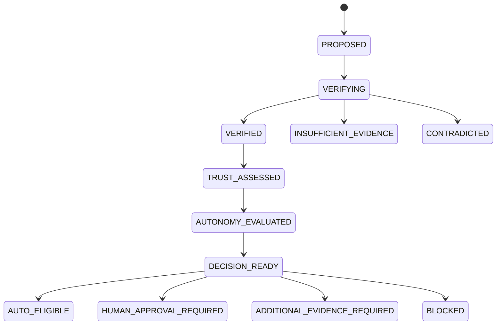

# 🛡️ Enterprise Trust, Verification & Safe Autonomy Subsystem (`agents/trust`)

The **Enterprise Trust, Verification & Safe Autonomy Subsystem** provides a decision-quality and safety layer between the Reasoning Engine (`agents/reasoning/`) and operational decisions.

---

> [!CAUTION]
> **SAFETY BOUNDARY NOTICE**
> `TrustAgent` decides whether a proposed action is safe and what approval level is required (`AUTO_ELIGIBLE`, `HUMAN_APPROVAL_REQUIRED`, `ADDITIONAL_EVIDENCE_REQUIRED`, `BLOCKED`).
> **`TrustAgent` DOES NOT execute network actions.**

---

## 🏗️ Decision Pipeline Architecture

```
                    ┌────────────────────────┐
                    │    ReasoningResult     │
                    └───────────┬────────────┘
                                │
                                ▼
                    ┌────────────────────────┐
                    │  EvidenceRevalidator   │ (Freshness & Integrity Audit)
                    └───────────┬────────────┘
                                │
                                ▼
                    ┌────────────────────────┐
                    │  AdversarialVerifier   │ (Disproof Probing)
                    └───────────┬────────────┘
                                │
                                ▼
                    ┌────────────────────────┐
                    │  CounterfactualEngine  │ (Scenario Validation)
                    └───────────┬────────────┘
                                │
                                ▼
                    ┌────────────────────────┐
                    │   BlastRadiusEngine    │ (Incident vs Action Impact)
                    └───────────┬────────────┘
                                │
                                ▼
                    ┌────────────────────────┐
                    │  AutonomyPolicyEngine  │ (Centralized Rule Enforcement)
                    └───────────┬────────────┘
                                │
                                ▼
                    ┌────────────────────────┐
                    │   DecisionExplainer    │ (Auditable Decision Rationale)
                    └───────────┬────────────┘
                                │
                                ▼
                    ┌────────────────────────┐
                    │     TrustDecision      │ (Safety Decision Payload)
                    └────────────────────────┘
```

---

## 🔄 Decision Lifecycle



---

## 💥 Blast Radius Analysis: Current vs Potential Action

The `BlastRadiusEngine` explicitly distinguishes between:
1. **Current Incident Blast Radius**: Impact caused by observed failure (e.g. 1 link/interface affected).
2. **Potential Action Blast Radius**: Impact if proposed remediation is applied (e.g. BGP reroute impacting 15 downstream core switches and 1,200 VPN users).

If **Potential Action Blast Radius** > **Current Incident Blast Radius**, the policy automatically enforces `HUMAN_APPROVAL_REQUIRED`.

---

## 📖 Developer Guide

### Adding Custom Autonomy Policy Rules
```python
from agents.trust import AutonomyPolicy, AutonomyPolicyEngine, BlastRadiusLevel

custom_policy = AutonomyPolicy(
    min_trust_score=0.90,
    max_blast_radius=BlastRadiusLevel.LOW,
    require_reversibility=True,
    require_rollback_plan=True,
    allow_auto_execution=True
)

engine = AutonomyPolicyEngine(policy=custom_policy)
```
